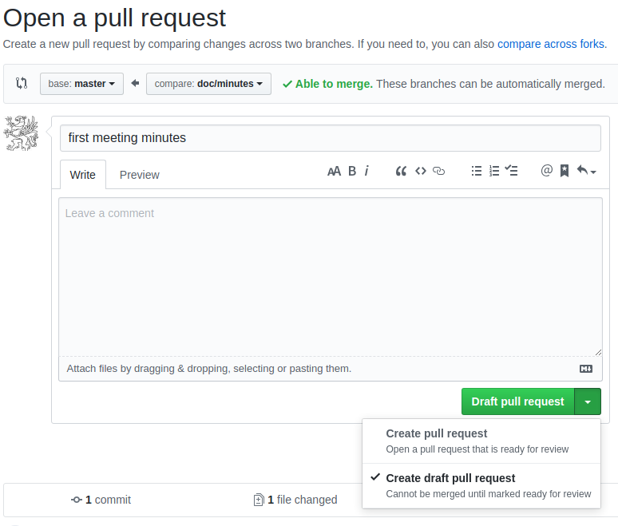

# Contributing

Take a look at the open issues and pull requests to see open tasks.
You are more than welcome to contribute any PR regardless if the issue or feature is listed or not.

## Workflow

- the `master`-branch is protected, so no commits can be pushed directly to it
- please create a new PR for any proposed changes
- **use the issue and PR templates**
  - [Create an issue](https://github.com/CodeLionX/actordb/issues/new?template=bug_report_template.md)
- each branch must have one of the following prefixes:
  - `fix/` for bug fixes and small, urgent changes
  - `feature/` for new feature proposals
  - `refactor/` for refactorings that do not introduce new features
  - `doc/` for changes that only affect documentation files and **no source code**. Those branches will not be included in the automatic tests and builds by our CI.
  - `ci/` branches are automatically build by our CI. Mainly used for testing the CI configuration.
- when starting work on this project please use the [labels](https://github.com/CodeLionX/dODo/labels) to mark the state of your PR
  - if you create your PR before all changes are done, you can create the PR as a _draft_ and start with the label `WIP` (work in progress):
    
  - when you are finished with the PR, mark it ready for review with `Needs Review`
  - if the reviewer approves your PR, he/she can mark it with `Merge` or merge it into master directly
  - when your PR is marked with `Merge`, any contributor is allowed to merge the PR into the `master` branch


## Set up development environment (Linux)

### Use commandline tools

- Install JDK, eg. JDK-1.8:

  ```sh
  sudo apt install openjdk-8-jdk
  ```

- Install `sbt`, see [Download SBT](https://www.scala-sbt.org/download.html):

  ```sh
  echo "deb https://dl.bintray.com/sbt/debian /" | sudo tee -a /etc/apt/sources.list.d/sbt.list
  sudo apt-key adv --keyserver hkp://keyserver.ubuntu.com:80 --recv 2EE0EA64E40A89B84B2DF73499E82A75642AC823
  sudo apt-get update
  sudo apt-get install sbt
  ```


### Use IDE, eg. Intellij IDEA

- Install JDK, eg. JDK-1.8:

  ```sh
  sudo apt install openjdk-8-jdk
  ```

- [Download](https://www.jetbrains.com/idea/download/#section=linux) and install Intellij IDEA
- Install _Scala_ and _SBT_ plugins
- Import project _as an SBT project_ (only available after installing the _SBT_ plugin), see screenshot below
  
  

## Set up development environment (Windows)

**tbd**