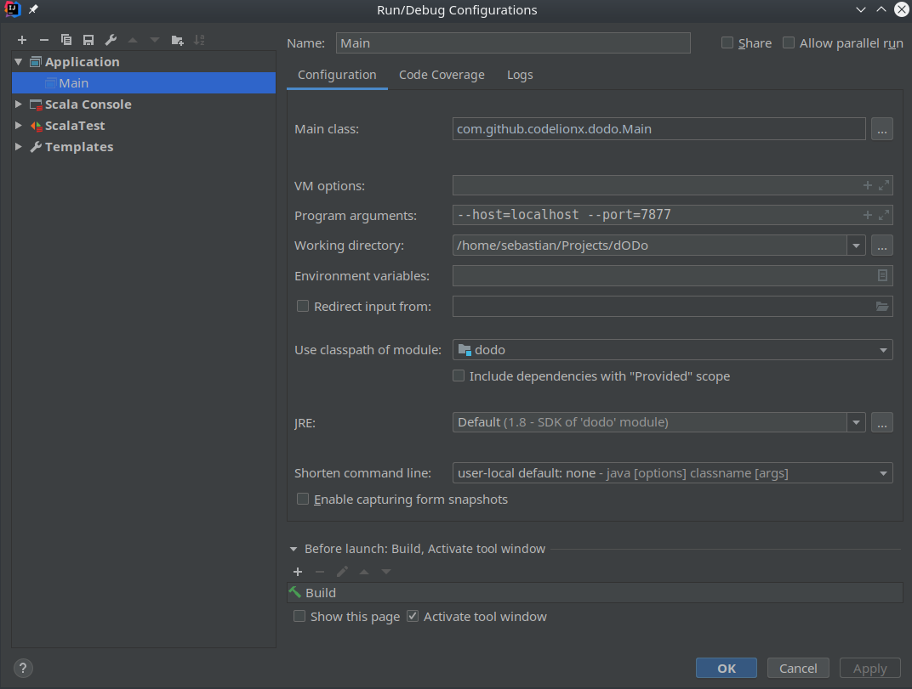

# dODo [](https://travis-ci.com/CodeLionX/dODo) [](https://www.codacy.com/app/CodeLionX/dODo?utm_source=github.com&amp;utm_medium=referral&amp;utm_content=CodeLionX/dODo&amp;utm_campaign=Badge_Grade) [](https://www.codacy.com/app/dodo/dODo?utm_source=github.com&utm_medium=referral&utm_content=CodeLionX/dODo&utm_campaign=Badge_Coverage)
**d**istributed **O**rder **D**ependency **o**ptimization - An HPI seminar work at the _Information Systems_ chair

Link to data sets: [HPI Repeatability: FDs](https://hpi.de/naumann/projects/repeatability/data-profiling/fds.html).

## Running the algorithm

You can configure the algorithm before packing it into a `jar` in the [`application.conf`-file](./src/main/resources/application.conf).
For all available options please consider the [`reference.conf`-file](./src/main/resources/reference.conf).

After the algorithm was packaged, you can still change some configuration options via the CLI.
Use the option `--help` to display the help page shown below:

```
Usage

 dODo [options] : Distributed Order dependency Discovery Optimization - discover order dependencies through order compatibility dependencies in CSV files

Options

   --host       : this machine's hostname or IP to bind against
   --input-file : path to the input CSV file. Required for the seed node! If not specified, this node tries to fetch the data from another node (potentially the seed node).
   --port       : port to bind against
   --seed-host  : hostname or IP address of the cluster seed node
   --seed-port  : port of the cluster seed node

```

There are different ways to run the algorithm.
They are described in the following sections.


### Using SBT

Please make sure that you have SBT version >= 1.2.8 installed and your `JAVA_HOME` is pointing to a JRE or JDK 1.8.x installation.
Newer versions of Java are not supported!

Issue the following command from the project root directory:

```bash
sbt "run --host=localhost --port=7877"
```

The double quotes around the `run` command and the program arguments are necessary.

### Using IntelliJ

1. Create a new run configuration.
   - Add new configuration of type `Application`
   - Set as the main class.
   - You can add the above options as `Program arguments`. See screenshot below.

   

2. Execute the new run configuration.

### Running the jar (for production)

1. First build and package the application by running `sbt assembly`.
   This will create a fat jar (uber jar) that can be run independently.
2. Run the application with `java -jar <dodo-name>.jar --help`.
   Only Java version 1.8.x is supported!

## Contributing

If you want to contribute to this project, you are more then welcome to do so.
Please read the [contribution guidlines](./CONTRIBUTING.md) before submitting new issues or pull requests.