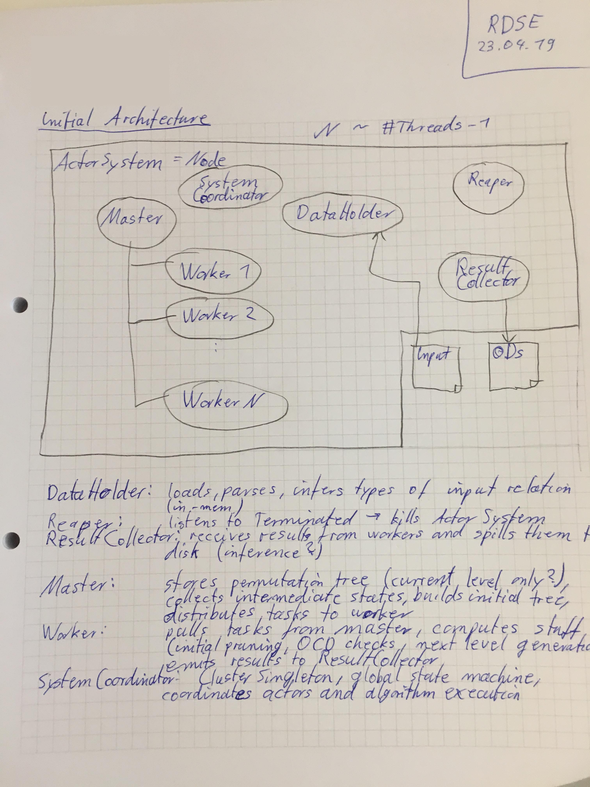

# Meeting 2019-04-23

## Recap last tasks

| Status | Who?  | Until when?   | What? |
| :----: | :---: | :------------ | :---- |
| :heavy_check_mark: | Sebi  | 23.04. | Setup infrastructure (Github Repos for Code, Paper) |
| :heavy_check_mark: | Sebi  | 23.04. | New OneDrive shared folder |
| :heavy_check_mark: | Jul, Sebi | 23.04. | Skim papers |
| :heavy_check_mark: | Jul   | 23.04. | Copy notes (translate if necessary) |

## Resources

We collect helpful resources in a separate [document in the `doc`-Folder](../resources-collection.md).

## Mini Expose Status & Feedback
- start by replicating data on every node
- start simple (more complex distribution later)
- stay close to paper algorithm
- collect optimizing ideas for later use

## Rough Architecture

## Next tasks

| Who?  | Until when?   | What? |
| :---: | :------------ | :---- |
| Jul | 25.04. | Email to paper authors (Cristion.Consonni@unitn.it), Thorsten cc |
| Jul, Sebi | 30.04. | finish mini expose |
| Jul | 30.04. | read up on scala documentation (https://docs.scala-lang.org/cheatsheets/) |
| Sebi |  | add data link to README |
