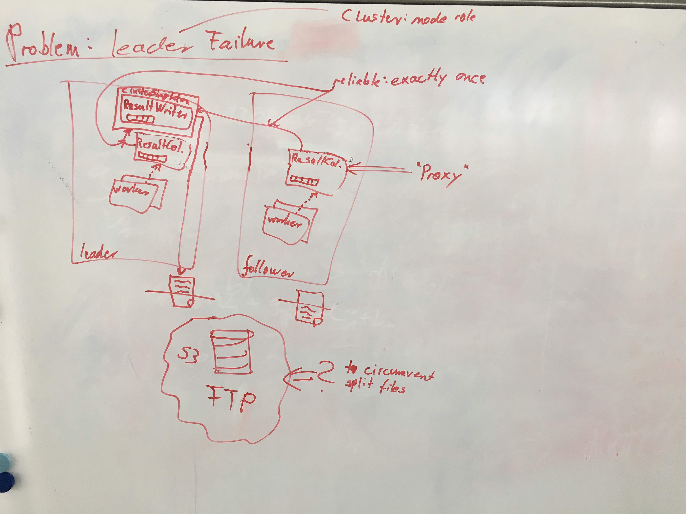

# Meeting 2019-0-07

## Recap last tasks

| Status | Who?  | Until when?   | What? |
| :----: | :---: | :------------ | :---- |
| :heavy_check_mark: | Jul       | 25.04. | Email to paper authors (Cristion.Consonni@unitn.it), Thorsten cc |
| :heavy_check_mark: | Jul, Sebi | 30.04. | finish mini expose |
| :heavy_check_mark: | Jul       | 30.04. | read up on scala documentation (https://docs.scala-lang.org/cheatsheets/) |
| :heavy_check_mark: | Sebi      |        | add data link to README |

## Naming convention

- For nodes in a cluster, we will use the following names:
  - **Leader** for the node with the `leader` role (only one)
  - **Follower** for nodes with the `follower` role (many)
- For distributing work across actors in our algorithm implementation,
  independent from their location in the cluster,
  we talk about
  - the **Master** actor and
  - **Worker** actors

## Implementation status

- different options of storing results:
  - `ResultCollector` actors are all identical
    - if node is Leader they write to disk
    - else forward to `ResultCollector` on Leader
  - cluster singleton `ResultWriter` used by all `ResultCollector`s
    - FTP or local files?
    - `ResultCollector`s act as proxy for exactly-once messaging to `ResultWriter`
    - expect acknowledgement for received messages?
      
  - `ResultCollector`s broadcast found ODs to each other
    - each one writes to own file
    - how to make sure all nodes receive message?
    - use akkaRouter?
- Use traits for the implementation of algorithmic tasks 
- Use queue to store OD candidates in master actor
  - different queue for in-progress candidates 

## Next tasks

| Who?  | Until when?   | What? |
| :---: | :------------ | :---- |
| Jul   | 14.05. | Write pruning of constant and order equivalent columns |
| Sebi  | 14.05. | TypeColumn ordering |
| Sebi  | 14.05. | Multicolumn Ordering (generateIndex) |
| Jul   | 14.05. | generate Tasks for Workers |
| Sebi  | 14.05. | check candidate |
| Jul   | 14.05. | generateNextLevel |
| Jul   | 14.05. | have resultCollector write results to console |
| Jul, Sebi | 14.05. | write tests |
| Sebi  | 14.05. | create csv header extraction issue |
| Sebi  | 14.05. | insert picture for resultCollector architecture |
| Jul   | 14.05. | add .gitignore to minutes branch |
| Sebi  | 14.05. | change node role names to match new naming convention |