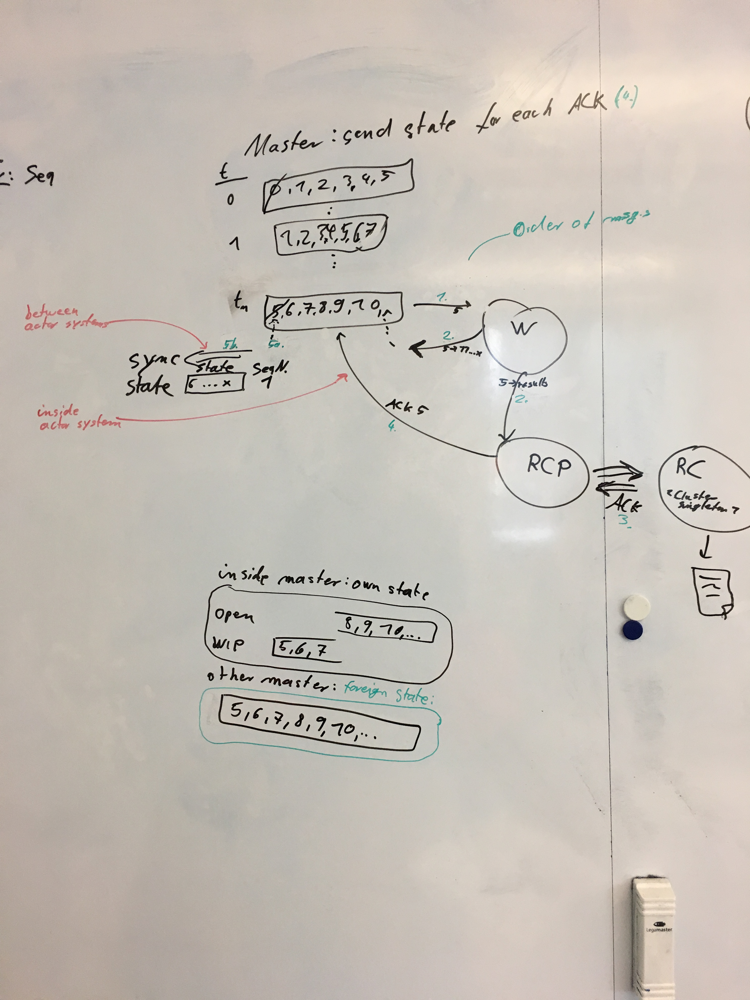
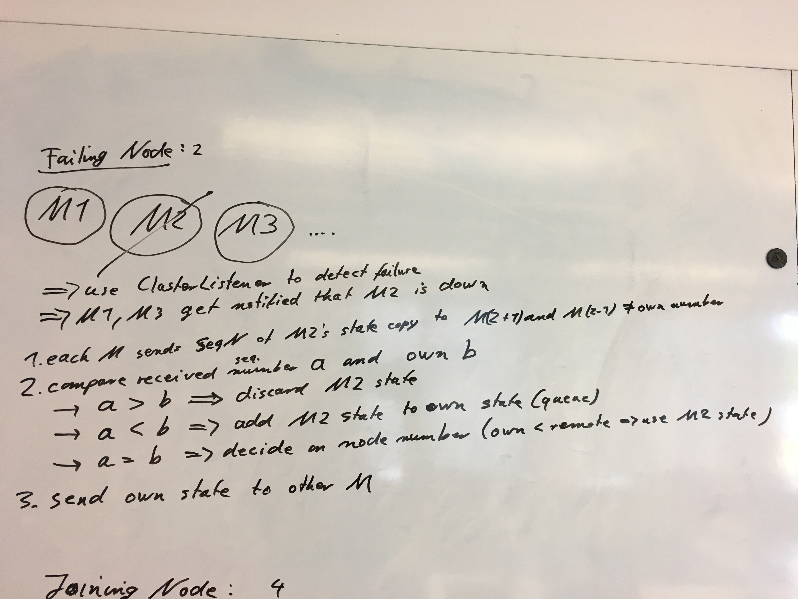
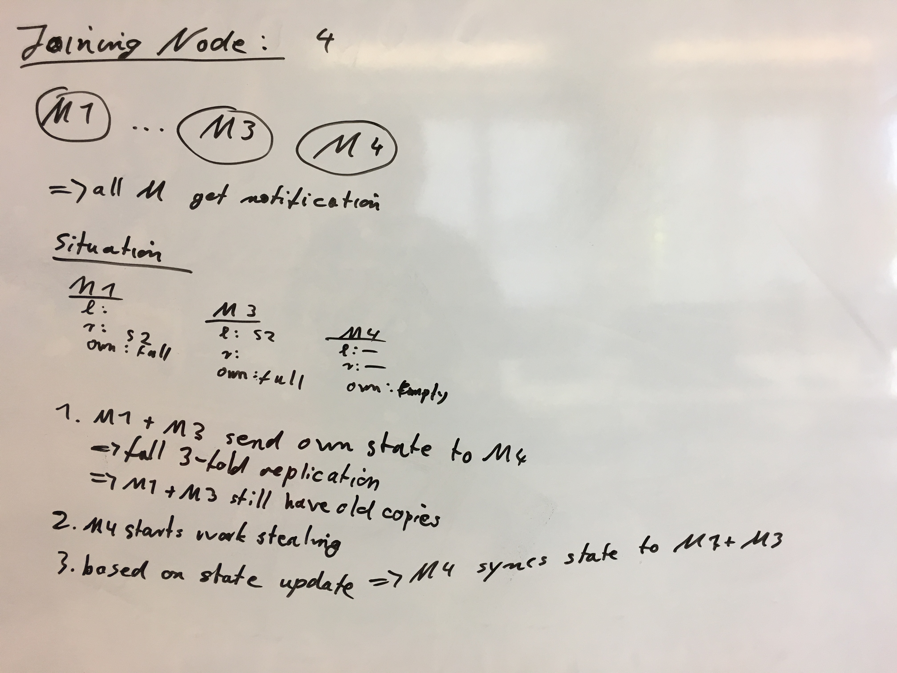

# Meeting 2019-05-23

## Recap last tasks

| Status | Who?  | Until when?   | What? |
| :----: | :---: | :------------ | :---- |
| ongoing | Jul, Sebi |  | write tests |
| :heavy_check_mark: | Jul, Sebi | 23.05. | Check algorithm implementation to be consistent with baseline (code from paper) |
| :heavy_check_mark: | Jul | 23.05. | Check, why we have different results than our baseline |
| :heavy_check_mark: | Sebi | 23.05. | Header extraction for CSVs |
| partially | Sebi | 23.05. | Use configuration file for type inference buffer and do not panic on EOF if file is empty before inference number is reached |
| :x: | Sebi | 28.05. | test all available datasets to be compatible to our algorithm and fix issues |

## Master state replication and synchronization

## Next tasks

| Who?  | Until when?   | What? |
| :---: | :------------ | :---- |
| Sebi | 28.05. | Do not throw exception on EOF if file is empty before inference number is reached |
| Sebi | 28.05. | Use column names (parsed from CSV or synthetic) for output |
| Sebi | 28.05. | test all available datasets to be compatible to our algorithm and fix issues |
| Jul  | 28.05. | write E2E (acceptance) test for our test data set |