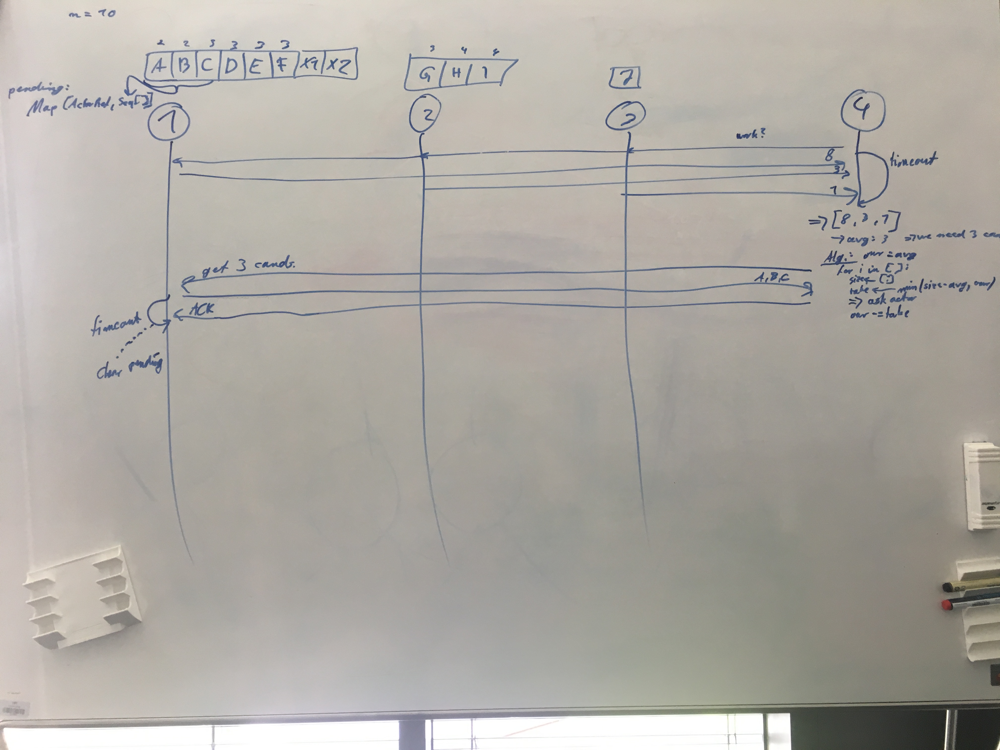

# Seminar Meeting 2019-06-11

## Recap last tasks

| Status | Who?  | Until when?   | What? |
| :----: | :---: | :------------ | :---- |
| :x: |  | somewhen | Check, why we only need 40seconds for the flight_1k dataset, instead of over 5h -- maybe it's because of our `null`-handling |
| :heavy_check_mark: | Jul, Sebi | 11.06. | work on presentation |

## Midterm presentation feedback

- more specific on agenda
- look into fixing the algorithm error (errata note): try generating all candidates
- questions:
  - What happens if node 0 comes back during the failure recovery?
  - State replication could use a lot of bandwith as the number of candidates grows factorial
  - Is there a formal (theoretical) framework for proving the correctness of protocol implementations (all corner cases of protocol)?

## Definition of work stealing protocol

1. joining (our of work) nodes sends broadcast
2. all nodes try to send response with their work queue size
3. after all nodes replied or a timeout occurred, the initiating node decides on which nodes to steal work from
   - calculate average queue size --> target queue size for this node
   - sort other nodes by their queue size and steal from top to down
   - steal a maximum of target queue size or till they have the average queue size
4. acknowledge data receipt
5. other nodes wait only until timeout expires for the ACK, otherwise they put the candidates back into their queue

Maybe look into reliable proxy pattern to increase reliability of protocol.

## De-duplication protocol

- our algorithm might (will) produce duplicate results
- we should remove duplicates from our output
- we decided that this can be done after our algorithm has run (out-of-scope)

## Next Tasks

| Who?  | Until when?   | What? |
| :---: | :------------ | :---- |
| Sebi | 18.06. | Find out why we only use far below 100% of CPU power |
| Jul | 18.06. | Think about generating all candidates (fix the pruning errors of OCDDISCOVER) |
| Jul | 18.06. | Implement work stealing protocol with [Akka PubSub](https://doc.akka.io/docs/akka/current/distributed-pub-sub.html) for broadcasting |
|  | somewhen | Check, why we only need 40seconds for the flight_1k dataset, instead of over 5h -- maybe it's because of our `null`-handling |
|  |  | Create protocol document for work stealing protocol |
|  |  | Create protocol document for state synchronization protocol |
|  |  | Protocol document: how do we handle joining nodes or overdue messages during the recovery phase? |
